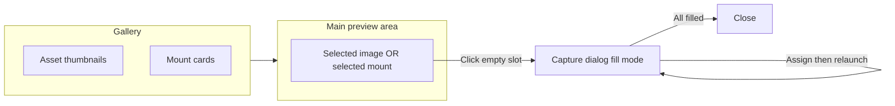

# Mount fill: single view, mount in preview, gallery with mounts

## Goal

1. **Single view** – No separate "Images" vs "Mounts" view. One layout: main preview area + one gallery that shows both images and mounts.
2. **Mount in main preview** – When the user selects a mount (or creates a new one), the **main preview area** (top card, same as for a selected image) shows that mount (MountView with placeholders). When they select an image, the preview shows that image as today.
3. **Click placeholder to start continuous capture** – When a mount is shown in the preview, clicking an **empty placeholder** starts the capture flow: capture dialog opens in fill mode and runs until all placeholders are filled (capture → assign to next slot → relaunch capture → repeat).
4. **Mounts in gallery** – The gallery shows **both** image assets and mounts in one list (e.g. by date, with mounts represented as cards/thumbnails alongside asset thumbnails).

---

## Current state (reference)

- **View modes**: [Imaging.tsx](apps/web/src/pages/Imaging.tsx) uses `viewMode: 'images' | 'mounts'`. Images view = preview + gallery of assets. Mounts view = left list of mounts + right detail (mount layout or asset detail).
- **Preview**: In images view, the top Card shows `selectedAsset` or "Select an image". In mounts view, the right panel shows selected mount (MountView) inside a Card.
- **Gallery**: Only shows assets, grouped by capture date. Mounts are not in the gallery.
- **Create Mount**: Opens CreateMountDialog; on success switches to mounts view and selects the new mount.

---

## Target UX

- **One layout**: Top = preview (one Card). Bottom = gallery (scrollable). No left/right split for mounts.
- **Selection**: User can select an **asset** (preview shows image) or a **mount** (preview shows MountView). Selection is mutually exclusive (selecting an asset clears selected mount and vice versa).
- **New mount**: After Create Mount, new mount appears in the gallery and is **selected**; preview immediately shows that mount (empty placeholders). User **clicks an empty placeholder** in the preview to open the capture dialog in fill mode.
- **Gallery contents**: Items are a mix of assets and mounts. Options: (a) One list ordered by date (mounts use `created_at`), with mounts rendered as small cards (e.g. mini MountView or Layout icon + name); (b) Two subsections in the same gallery ("Images" and "Mounts"); (c) Interleaved by date with a type indicator. Recommended: single scrollable list ordered by date (date groups), each group can contain both asset thumbnails and mount cards so mounts sit alongside images.

---

## Implementation plan

### 1. Remove view-mode split and use a single layout

- **File**: [apps/web/src/pages/Imaging.tsx](apps/web/src/pages/Imaging.tsx).
- Remove `viewMode` state (or keep only for any future need; do not branch layout on it).
- **Single layout**:
  - **Top (preview)**: One Card, same as current "images view" top. Content:
    - If `selectedAsset`: show that image (current behavior: AuthenticatedImage, Modify/Delete buttons).
    - Else if `selectedMount`: show **MountView** for `selectedMount` (full area, same as current MountView but in the main preview card). Empty slots are clickable to start fill-mode capture.
    - Else: show "Select an image or mount" (or keep "Select an image" and add "or mount").
  - **Bottom (gallery)**: One Card with header "Gallery" and actions (Capture Image, Create a Mount). Content: **unified list** of assets and mounts (see below). Clicking an asset sets `selectedAsset` and clears `selectedMount`. Clicking a mount sets `selectedMount` and clears `selectedAsset`.

### 2. Gallery: show mounts alongside assets

- **Data**: Keep `assets` (from subscription or listAssets) and `mounts` (from listMounts). Both are already available on the page.
- **Unified list**: Build a single ordered list (or grouped by date) that includes:
  - **Assets**: same as today (grouped by capture date, grid of thumbnails).
  - **Mounts**: include in the same gallery. Option A – add a "Mounts" section (e.g. after or before date groups) with mount cards. Option B – treat mounts as items with a "date" (e.g. `created_at`) and interleave with asset date groups (e.g. "Feb 16, 2025" group has both images from that day and mounts created that day). Option B gives a single chronological feed.
- **Mount card in gallery**: Each mount is a clickable card. Show: small preview (e.g. mini MountView grid with placeholders/filled slots, or a Layout icon) + mount name + template name or slot count. Same row or grid as asset thumbnails (e.g. same grid, mount cards same aspect or slightly larger).
- **Selection**: On mount click: `setSelectedMount(mount)`, `setSelectedAsset(null)`. On asset click: `setSelectedAsset(asset)`, `setSelectedMount(null)`.

### 3. Mount in preview: click empty slot to start fill-mode capture

- **Preview when mount selected**: Render MountView in the main preview Card (dark background optional; can match current image preview styling). Pass `mount`, `availableAssets`, `onMountUpdate`, and **onSlotClick**.
- **onSlotClick behavior** when the slot is **empty**: Open the capture dialog in **fill mode** for this mount (set `captureDialogMount = selectedMount`, `setCaptureDialogOpen(true)`). So "click placeholder" = open capture dialog in fill mode.
- **onSlotClick when slot has image**: Keep current or desired behavior (e.g. open asset picker to replace, or remove). Plan assumes: empty slot → start fill-mode capture; filled slot → optional replace/remove (existing or TODO).
- **Create Mount flow**: After CreateMountDialog `onCreated(mount)`: do **not** switch view mode. Add the new mount to the gallery (fetch mounts if needed), `setSelectedMount(mount)`, `setSelectedAsset(null)`. Preview updates to show the new mount. User then clicks an empty placeholder in the preview to start capture.

### 4. Capture dialog fill mode (unchanged from prior plan)

- **CaptureImageDialog** accepts optional `mount`; when set, runs in fill mode: after each successful single-image upload, assign that asset to the next empty slot (via `getNextEmptySlotId` and `assignAssetToMountSlot`), then relaunch (don’t close; clear state so user can capture again). When no more empty slots, close and call `onMountFillComplete`.
- **getNextEmptySlotId(mount)** in [apps/web/src/api/mounts.ts](apps/web/src/api/mounts.ts): use `getEffectiveSlotOrder` and current `mount_slots` to return the first empty slot id or null.
- In fill mode, don’t use direct upload for Capture Device so the web gets the file, uploads via `uploadMultipleAssets`, gets `assetId`, and assigns.
- **Imaging page**: When capture dialog closes after fill, clear `captureDialogMount`, refresh `selectedMount` (e.g. `getMount(selectedMount.id)`) and refresh mounts list so the preview and gallery stay in sync.

### 5. Cleanup

- Remove the old **mounts view** layout (left list of mounts + right detail panel). Delete or simplify any "Images | Mounts" toggle if present.
- Ensure **Create a Mount** and **Capture Image** buttons remain in the gallery header; Create a Mount no longer switches view, it just creates and selects the new mount and shows it in the preview.

---

## Files to touch (summary)

| Area | File | Changes |
|------|------|--------|
| API | [apps/web/src/api/mounts.ts](apps/web/src/api/mounts.ts) | Add `getNextEmptySlotId(mount)`. |
| Dialog | [apps/web/src/components/imaging/CaptureImageDialog.tsx](apps/web/src/components/imaging/CaptureImageDialog.tsx) | Optional `mount`, `onMountUpdated`, `onMountFillComplete`; single-image assign + relaunch; no direct upload in fill mode for Capture Device; progress and "All filled" state. |
| Page | [apps/web/src/pages/Imaging.tsx](apps/web/src/pages/Imaging.tsx) | Single layout: preview shows selected asset OR selected mount (MountView); gallery shows assets and mounts together; remove mounts-only view; on empty slot click in preview open capture in fill mode; Create Mount selects new mount and shows in preview; capture close refreshes selected mount. |
| MountView | [apps/web/src/components/imaging/MountView.tsx](apps/web/src/components/imaging/MountView.tsx) | Ensure `onSlotClick` is called when an empty slot is clicked (likely already); parent (Imaging) will pass handler that opens capture dialog in fill mode. |

---

## Order of work

1. **mounts.ts**: Add `getNextEmptySlotId(mount)`.
2. **CaptureImageDialog**: Add mount-fill mode (mount prop, assign after upload, relaunch until full).
3. **Imaging.tsx**: Unify layout (preview = asset or mount; one gallery); add mounts to gallery; remove second view; wire empty-slot click → open capture in fill mode; Create Mount → select new mount and show in preview; wire capture dialog mount state and refresh on close.
